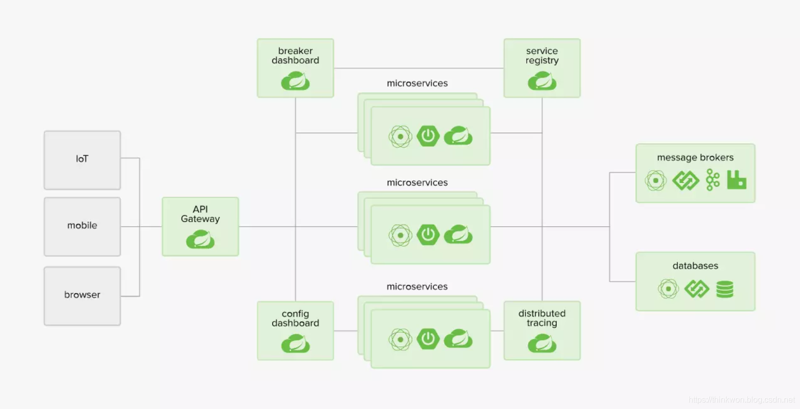
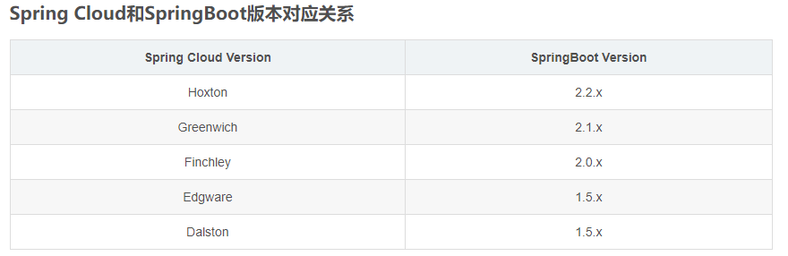
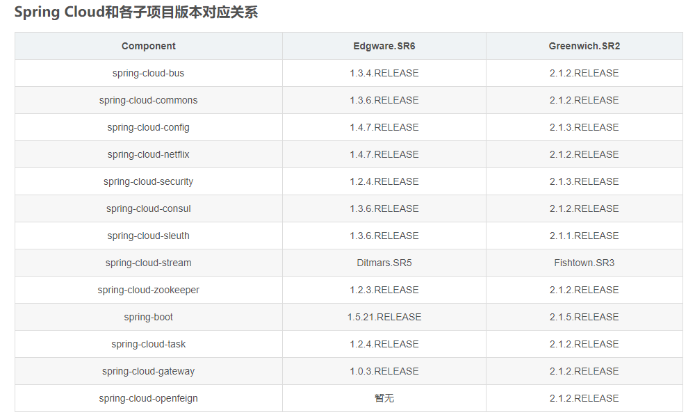
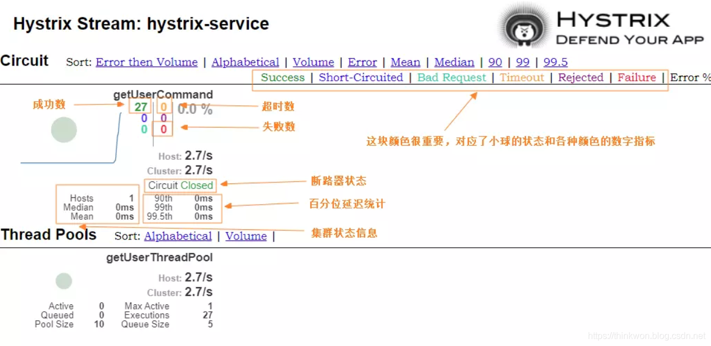
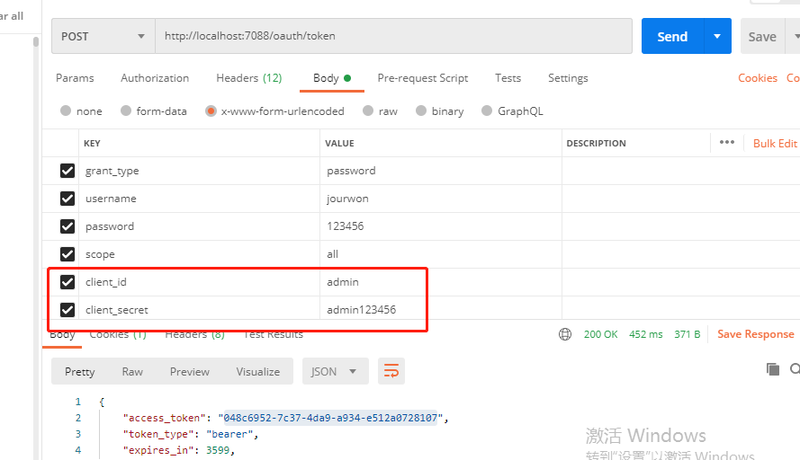
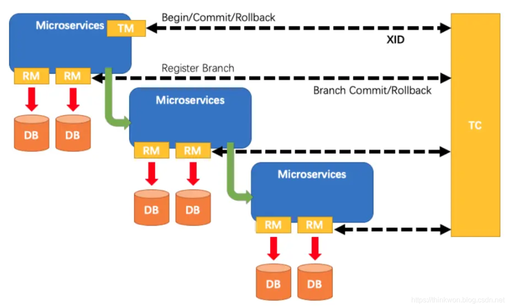

# fang-root
个人练手测试项目
#本项目旨在熟练 springcloud 全家桶。根据springcloud 的相关组件逐一新建相关模块进行代码开发测试。
1、为何要学习Spring cloud 
- 随着业务逐渐发展，产品思想会变得越来越复杂，单体结构的应用也会越来越复杂，微服务架构逐渐取代了单体架构，且这种趋势将会越来越流行。Spring Cloud是目前最常用的微服务开发框架，已经在企业级开发中大量的应用。

2、什么是Spring Cloud
- Spring Cloud是一系列框架的有序集合。它利用Spring Boot的开发便利性巧妙地简化了分布式系统基础设施的开发，如服务发现注册、配置中心、智能路由、消息总线、负载均衡、断路器、数据监控等，都可以用Spring Boot的开发风格做到一键启动和部署。通过Spring Boot风格进行再封装屏蔽掉了复杂的配置和实现原理，最终给开发者留出了一套简单易懂、易部署和易维护的分布式系统开发工具包。

3、设计目标与优缺点
 
- 3.1 目标：旨在协调各个微服务，简化分布式系统开发。
- 3.2 优缺点： 
  
   - 3.2.1  微服务的框架那么多比如：dubbo、Kubernetes，为什么就要使用Spring Cloud的呢？
   
   - 3.2.2  优点：
  
      - 产出于Spring大家族，Spring在企业级开发框架中无人能敌，来头很大，可以保证后续的更新、完善
      
      - 轻轻松松几行代码，注解或者配置就完成了熔断、负载均衡、注册中心的各种平台功能
      
      - Spring Cloud 社区活跃度很高，教程很丰富，遇到问题很容易找到解决方案
      
      - 服务拆分粒度更细，耦合度比较低，有利于资源重复利用，有利于提高开发效率
      
      - 可以更精准的制定优化服务方案，提高系统的可维护性
      
      - 减轻团队的成本，可以并行开发，不用关注其他人怎么开发，先关注自己的开发
      
      - 微服务可以是跨平台的，可以用任何一种语言开发
     
     - 适于互联网时代，产品迭代周期更短
    
   - 3.2.3 缺点：

     - 微服务过多，治理成本高，不利于维护系统
  
     - 分布式系统开发的成本高（容错，分布式事务等）对团队挑战大

4 、整体架构




5、主要项目
  
Spring Cloud的子项目，大致可分成两类，一类是对现有成熟框架"Spring Boot化"的封装和抽象，也是数量最多的项目；第二类是开发了一部分分布式系统的基础设施的实现，如Spring Cloud Stream扮演的就是kafka, ActiveMQ这样的角色。

### Spring Cloud Config
  集中配置管理工具，分布式系统中统一的外部配置管理，默认使用Git来存储配置，可以支持客户端配置的刷新及加密、解密操作。
### Spring Cloud Netflix
  Netflix OSS 开源组件集成，包括Eureka、Hystrix、Ribbon、Feign、Zuul等核心组件。

   - Eureka：服务治理组件，包括服务端的注册中心和客户端的服务发现机制；
   - Ribbon：负载均衡的服务调用组件，具有多种负载均衡调用策略；
   - Hystrix：服务容错组件，实现了断路器模式，为依赖服务的出错和延迟提供了容错能力；
   - Feign：基于Ribbon和Hystrix的声明式服务调用组件；
   - Zuul：API网关组件，对请求提供路由及过滤功能。

### Spring Cloud Bus
用于传播集群状态变化的消息总线，使用轻量级消息代理链接分布式系统中的节点，可以用来动态刷新集群中的服务配置。
### Spring Cloud Consul
基于Hashicorp Consul的服务治理组件。
### Spring Cloud Security
安全工具包，对Zuul代理中的负载均衡OAuth2客户端及登录认证进行支持。
### Spring Cloud Sleuth
Spring Cloud应用程序的分布式请求链路跟踪，支持使用Zipkin、HTrace和基于日志（例如ELK）的跟踪。
### Spring Cloud Stream
轻量级事件驱动微服务框架，可以使用简单的声明式模型来发送及接收消息，主要实现为Apache Kafka及RabbitMQ。
### Spring Cloud Task
用于快速构建短暂、有限数据处理任务的微服务框架，用于向应用中添加功能性和非功能性的特性。
### Spring Cloud Zookeeper
基于Apache Zookeeper的服务治理组件。
### Spring Cloud Gateway
API网关组件，对请求提供路由及过滤功能。
### Spring Cloud OpenFeign
基于Ribbon和Hystrix的声明式服务调用组件，可以动态创建基于Spring MVC注解的接口实现用于服务调用，在Spring Cloud 2.0中已经取代Feign成为了一等公民。
### Spring Cloud的版本关系
#### Spring Cloud和SpringBoot版本对应关系

  
#### Spring Cloud和各子项目版本对应关系

  注意：Hoxton版本是基于SpringBoot 2.2.x版本构建的，不适用于1.5.x版本。随着2019年8月SpringBoot 1.5.x版本停止维护，Edgware版本也将停止维护。

6、Spring Boot的关系

- Spring Boot 是 Spring 的一套快速配置脚手架，可以基于Spring Boot 快速开发单个微服务，Spring Cloud是一个基于Spring Boot实现的云应用开发工具。Spring -> Spring Boot > Spring Cloud 这样的关系。
- Spring Boot可以离开Spring Cloud独立使用开发项目，但是Spring Cloud离不开Spring Boot，属于依赖的关系
- Spring Boot专注于快速、方便集成的单个个体微服务，Spring Cloud是关注全局的服务治理框架
- Spring Boot使用了默认大于配置的理念，很多集成方案已经帮你选择好了，能不配置就不配置，Spring Cloud很大的一部分是基于Spring Boot来实现，可以不基于Spring Boot吗？不可以


# 根据以上思路，搭建了本项目。本项目是一个微服务架构的项目。然后根据组件一步一步来进行的。

## 1.创建root跟项目。该模块是父模块。管理所有的子服务
## 2.搭建Eureka注册中心  (fang-eureka)
 - 引入jar包
```<dependency>
   <groupId>org.springframework.cloud</groupId>
   <artifactId>spring-cloud-starter-netflix-eureka-server</artifactId>
   </dependency>
```
 - 在启动类加上@EnableEurekaServer注解来启用Euerka注册中心功能
 - 在配置文件添加相关的配置表明这是注册中心（配置见代码，模块： fang-eureka ）
 - 可以引入spring-boot-starter-security 依赖，这样就需要密码登录后台，默认情况下添加SpringSecurity依赖的应用每个请求都需要添加CSRF token才能访问，Eureka客户端注册时并不会添加，所以需要配置/eureka/**路径不需要CSRF token。
## 2.搭建业务模块，也是Eureka 的客户端 ( fang-user  fang-order fang-common-starter ) 
 这里我首先创建了 fang-modules 模块  来统一管理所有的业务模块。然后再该模块下面搭建业务模块，
 我这里暂时只有 fnag-order(订单) 和 fang-user（用户） 2个模块。同时创建了common-starter 模块,该模块主要是一些公共的jar包和一些工具类等
 - 在common 引入jar
```
   <dependency>
   <groupId>org.springframework.boot</groupId>
   <artifactId>spring-boot-starter-web</artifactId>
   </dependency>
   <dependency>
   <groupId>org.springframework.cloud</groupId>
   <artifactId>spring-cloud-starter-netflix-eureka-client</artifactId>
   </dependency>
 ```
- 在启动类上添加@EnableDiscoveryClient注解表明是一个Eureka客户端
- 配置文件添加Eureka客户端的配置
 #### Eureka注册中心集群,可以修改端口，启动2个，然后再客户端的配置文件配置多个地址即可。打开注册中心页面，就可以看到相关的服务已经注册了。
## 3.Ribbon服务消费者   ( fang-ribbon-service  )
负载均衡 。。。微服务架构中，很多服务都会部署多个。其他服务去调用该服务的时候，如何保证负载均衡是个不得不去考虑的问题。负载均衡可以增加系统的可用性和扩展性.
Ribbon就很好的实现了负载均衡。
- 需要添加的依赖
```
   <dependency>
    <groupId>org.springframework.boot</groupId>
    <artifactId>spring-boot-starter-web</artifactId>
</dependency>

```
- 因为还未使用feign,此处我们就先使用 RestTemplate 来调用服务。模块是 fang-ribbon-service 在启动类需要开启RestTemplate负载均衡功能。
- 启动2个user模块，然后调用。可以看到交替请求。
- ribbon 的常用配置主要有：重试次数、超时时间、负载均衡算法等等。
## 4.Hystrix断路器  （ fang-hystrix ）
Hystrix具备服务降级、服务熔断、线程隔离、请求缓存、请求合并及服务监控等强大功能。
- 需要的依赖
```
<dependency>
    <groupId>org.springframework.cloud</groupId>
    <artifactId>spring-cloud-starter-netflix-hystrix</artifactId>
</dependency>
```
- 启动类上添加@EnableCircuitBreaker来开启Hystrix的断路器功能
- 业务代码可以实现 降级，忽略某些异常、分组、线程池、请求缓存、请求合并等功能，具体见 HystrixServiceImpl
- 配置文件可以配置上一条需要的相关参数
## 5.Hystrix Dashboard与Turbine断路器监控 （ fang-hystrix-dashboard ）
 上面已经集成了Hystrix,但是需要实时监控HystrixCommand方法的执行情况，Hystrix提供了Hystrix Dashboard。Hystrix Dashboard可以有效地反映出每个Hystrix实例的运行情况，帮助我们快速发现系统中的问题，从而采取对应措施。

 展示hystrix实例监控信息的仪表盘
- 需要的依赖。
```
<dependency>
	<groupId>org.springframework.cloud</groupId>
	<artifactId>spring-cloud-starter-netflix-hystrix-dashboard</artifactId>
</dependency>
<dependency>
	<groupId>org.springframework.boot</groupId>
	<artifactId>spring-boot-starter-actuator</artifactId>
</dependency>
```
- 启动类上添加@EnableHystrixDashboard来启用监控功能：
- 被监控的hystrix-service服务需要开启Actuator的hystrix.stream端点，见fang-hystrix得配置文件
- 访问Hystrix Dashboard：http://localhost:7076/hystrix
- 监控页面图，http://localhost:7075/actuator/hystrix.stream  title为：hystrix-client

  
### 微服务一般是集群，则需要 Turbine来聚合hystrix-service服务的监控信息 （ fang-urbine-service ）

聚合收集hystrix实例监控信息的服务
- 添加依赖spring-cloud-starter-netflix-turbine
- 配置Turbine相关配置，见fang-urbine-service配置文件
- 启动类上添加@EnableTurbine来启用Turbine相关功能
- 集群地址：http://localhost:7077/tuebine.stream title为：hystrix-client。可以看到监控实例是多个
## 6.OpenFeign服务消费者 
&nbsp;&nbsp;&nbsp;
Spring Cloud OpenFeign 是声明式的服务调用工具，它整合了Ribbon和Hystrix，拥有负载均衡和服务容错功能.需要加上依赖：spring-cloud-starter-openfeign
在启动类上添加@EnableFeignClients注解来启用Feign的客户端功能。
-  通过@FeignClient注解实现了一个Feign客户端，其中的value为user-service表示这是对user-service服务的接口调用客户端。
-  添加服务降级实现类UserFallbackService
- 配置文件添加 ribbon相关的配置
-  在配置文件开启Hystrix功能:
```
   feign.hystrix.enabled: true
```
## 7.-Zuul服务网关 （fang-gateway）
API网关为微服务架构中的服务提供了统一的访问入口，客户端通过API网关访问相关服务。API网关的定义类似于设计模式中的门面模式，它相当于整个微服务架构中的门面，所有客户端的访问都通过它来进行路由及过滤。
- 它实现了请求路由、负载均衡、校验过滤、服务容错、服务聚合等功能。
- 添加依赖：spring-cloud-starter-netflix-zuul
- 启动类上添加@EnableZuulProxy注解来启用Zuul的API网关功能
- 在配置文件配置路由规则，可以设置统一访问前缀、关闭默认规则等等规则都可以配置
- 自定义的过滤器类型，添加OwnZuulFilter类继承ZuulFilter，访问：http://localhost:9200/api/orderService/order/getWay
- 通过SpringBoot Actuator来查看Zuul中的路由信息，通过访问http://localhost:9200/actuator/routes查看简单路由信息：
## 8.Config分布式配置中心  （fang-config-server   fang-config-client）
 springcloud config 分为服务端和客户端 2个部分，服务端分为分布式配置中心
是一个独立的应用。主要是从配置仓库获取配置信息并提供给客户端使用。也就是说，服务端必须开启。
一般存储在git仓库。
- 添加相关的依赖
- 启动类上添加@EnableConfigServer注解来启用配置中心功能
- 服务端配置文件添加配置：仓库地址，用户名，密码等
- 客户端配置文件可以配置：分支，环境，文件夹等信息
- 刷新配置：添加Actuator的依赖，然后在bootstrap.yml中开启refresh端点，在controller 里面添加@RefreshScope注解用于刷新配置
- 每次更改需要调用刷新接口进行刷新，无法动态
## 9.Bus消息总线
Spring Cloud Bus 配合 Spring Cloud Config 使用可以实现配置的动态刷新。目前 Spring Cloud Bus 支持两种消息代理：RabbitMQ 和 Kafka
Spring Cloud Bus 通过轻量消息代理连接各个分布的节点
- 需要RabbitMQ
- config服务端添加依赖  spring-cloud-starter-bus-amqp
- config服务端配置文件添加rabbitmq配置
- 暴露了刷新配置的Actuator端点
- 客户端添加相关依赖 spring-cloud-starter-bus-amqp
- 客户端添加rabbitmq配置
- 启动相关服务，然后登录rabbitMQ后台，会发现springCloudBus的交换机及三个以 springCloudBus.anonymous开头的队列
- 当配置文件修改了：调用暴露的端点刷新所有配置：http://localhost:7079/actuator/bus-refresh
- 配合WebHooks使用，WebHooks相当于是一个钩子函数，我们可以配置当向Git仓库push代码时触发这个钩子函数。当我们向配置仓库push代码时就会自动刷新服务配置了
## 10.Sleuth服务链路跟踪 （ order 和  user 来演示）
Spring Cloud Sleuth 是分布式系统中跟踪服务间调用的工具，它可以直观地展示出一次请求的调用过程。Zipkin是Twitter的一个开源项目，可以用来获取和分析Spring Cloud Sleuth 中产生的请求链路跟踪日志，它提供了Web界面来帮助我们直观地查看请求链路跟踪信息。
- 添加相关依赖spring-cloud-starter-zipkin
- 配置文件配置收集日志的zipkin-server访问地址，同时可设置收集率
- 下载zipkin的jar包。然后启动：java -jar zipkin-server-2.12.9-exec.jar，Zipkin页面访问地址：http://localhost:9411
- 启动相关的服务，然后多次请求，就可以看到完整的请求链路，每个服务的耗时等。
- 可以使用elk进行保存 追踪日志
- 安装Elasticsearch，安装可视化工具Kibana
- 修改启动参数将信息存储到Elasticsearch
```
  # STORAGE_TYPE：表示存储类型 ES_HOSTS：表示ES的访问地址
  java -jar zipkin-server-2.12.9-exec.jar --STORAGE_TYPE=elasticsearch --ES_HOSTS=localhost:9200
```
## 11.Consul服务注册发现与配置中心
Spring Cloud Consul 为 SpringBoot 应用提供了 Consul的支持，Consul既可以作为注册中心使用，也可以作为配置中心使用。
Spring Cloud Consul 具有如下特性：
- 支持服务治理：Consul作为注册中心时，微服务中的应用可以向Consul注册自己，并且可以从Consul获取其他应用信息；
- 支持客户端负责均衡：包括Ribbon和Spring Cloud LoadBalancer；
- 支持Zuul：当Zuul作为网关时，可以从Consul中注册和发现应用；
- 支持分布式配置管理：Consul作为配置中心时，使用键值对来存储配置信息；
- 支持控制总线：可以在整个微服务系统中通过 Control Bus 分发事件消息。
#### 使用Consul作为注册中心，
- 安装并运行Consul，首先我们从官网下载Consul，地址：https://www.consul.io/downloads.html
- 使用开发模式启动：(consul agent -dev) 通过以下地址可以访问Consul的首页：http://localhost:8500
- 将注册中心换成consul,依赖也改成Consul的，并添加SpringBoot Actuator的依赖
- 修改配置文件的注册中心，换成consul的
#### 使用Consul作为配置中心，
- 添加相关依赖：spring-cloud-starter-consul-config
- 配置文件：启动配置中心功能，格式、目录、分隔符、配置key的名字等
- 就可以获取配置文件的内容了
- Consul使用其**_自带的Control Bus_** 实现了一种事件传递机制，从而实现了**_动态刷新功能_**。使用Spring Cloud Config的时候，我们需要调用接口，通过Spring Cloud Bus才能刷新配置
## 12.Gateway服务网关  （fang-cloud-gatway）
 主要功能就是路由、熔断降低、限流、监控、健康检查
Spring Cloud Gateway 具有如下特性：
 - 动态路由：能够匹配任何请求属性；
 - 可以对路由指定 Predicate（断言）和 Filter（过滤器）；
 - 集成Hystrix的断路器功能；
 - 集成 Spring Cloud 服务发现功能；
 - 易于编写的 Predicate（断言）和 Filter（过滤器）；
 - 请求限流功能；
 - 支持路径重写。
   #### gatway主要步骤如下：
- 添加相关的jar  依赖
- Gateway 提供了两种不同的方式用于配置路由，一种是通过yml文件来配置，另一种是通过Java Bean来配置，
- 配置文件进行配置，通过配置zuul组件的相关规则可以指定到相关的服务，详细配置在配置文件
- 结合注册中心，需要  lb 协议支持负载均衡
-  gatway提供狠多个Route Predicate工厂可以进行组合
- 过滤器配置，例如可以配置指定路径的位数进行去除
#### Hystrix GatewayFilter
Hystrix 过滤器允许你将断路器功能添加到网关路由中，使你的服务免受级联故障的影响，并提供服务降级处理。
- 相关依赖
- 开发降级处理逻辑
- 配置文件配置Hystrix相关的，当路由出错时会转发到服务降级处理的控制器上
#### RequestRateLimiter GatewayFilter 
RequestRateLimiter 过滤器可以用于限流，使用RateLimiter实现来确定是否允许当前请求继续进行，如果请求太大默认会返回HTTP 429-太多请求状态。
- 添加依赖
- 添加限流策略的配置类，这里有两种策略一种是根据请求参数中的username进行限流，另一种是根据访问IP进行限流；
- 使用Redis来进行限流，所以需要添加Redis和RequestRateLimiter的配置，这里对所有的GET请求都进行了按IP来限流的操作；
- 配置文件配置相关限流政策，连续访问多次  ，后面的就会请求失败
#### Retry GatewayFilter
对路由请求进行重试的过滤器，可以根据路由请求返回的HTTP状态码来确定是否进行重试
- 配置文件配置相关，当服务500 的时候会重试多次
## 13.Admin服务监控中心
- Spring Boot Admin 可以对SpringBoot应用的各项指标进行监控，可以作为微服务架构中的监控中心来使用。
- SpringBoot应用可以通过Actuator来暴露应用运行过程中的各项指标，Spring Boot Admin通过这些指标来监控SpringBoot应用，然后通过图形化界面呈现出来。Spring Boot Admin不仅可以监控单体应用，还可以和Spring Cloud的注册中心相结合来监控微服务应用。
  #### Spring Boot Admin 可以提供应用的以下监控信息：
- 监控应用运行过程中的概览信息；
- 度量指标信息，比如JVM、Tomcat及进程信息；
- 环境变量信息，比如系统属性、系统环境变量以及应用配置信息；
- 查看所有创建的Bean信息；
- 查看应用中的所有配置信息；
- 查看应用运行日志信息；
- 查看JVM信息；
- 查看可以访问的Web端点；
- 查看HTTP跟踪信息。
    
springboot admin 配置
- 在启动类上添加@EnableAdminServer来启用admin-server功能
- 访问如下地址打开Spring Boot Admin的主页：http://localhost:7081
- 点击wallboard按钮，选择admin-client查看监控信息；度量指标信息，比如JVM、Tomcat及进程信息；环境变量信息，比如系统属性、系统环境变量以及应用配置信息
## Spring Cloud入门-Oauth2授权之JWT集成  （fang-oauth）
- 1.首先配置RedisTokenStoreConfig ，添加在Redis中存储令牌的配置：
    - 这个配置是Redis用来存储token，服务重启后，无需重新获取token
- 2.配置SecurityConfig
    - 添加SpringSecurity配置，允许授权相关路径的访问及表单登录
    - 获取token的时候参数grant_type 
    - 密码加密器等
- 3.配置ResourceServerConfig
  - 资源服务器配置
  -  配置需要保护的资源路径
- 4.配置AuthorizationServerConfig
  - 授权服务器配置
  - 配置认证管理器以及业务实现
    - 配置令牌存储策略:
      @Autowired
      @Qualifier("redisTokenStore")
      private TokenStore tokenStore;
    - 配置业务处理service
    - 认证管理器
  - 配置认证规则
    - 需要注意allowFormAuthenticationForClients 这个，允许通过get param方式进行验证。 如果不开放的话，就只能走Basic Auth验证。否则401
    - 不配置上面的，client_id 、client_secret传了也无法访问，http://localhost:7088/oauth/token
  - 配置客户端
      - 配置配置client_id 、client_secret、过期时间等
      - 配置作用域等
  - 使用JWT存储令牌，不使用redis
    - 添加JwtTokenStoreConfig
    - 新增JWT内容增强器
    - 更改配置
        @Autowired
        @Qualifier("jwtTokenStore")
        private TokenStore tokenStore;
  - token解析网站：https://jwt.io/

    针对Oauth2+Jwt的使用，本处只是简单的实现了获取token的开发，主要是熟悉相关的配置以及流程。也可以结合相关的服务实现
    网关鉴权，微服务间的多平台登录等。这个项目https://gitee.com/fangm886/oauth-demo-jwt.git 是一个单独的oauth+jwt的服务
    基本上是可以使用的。

## Nacos实现注册和配置中心
Nacos 提供了一组简单易用的特性集，帮助您快速实现动态服务发现、服务配置、服务元数据及流量管理。是Spring Cloud Alibaba 的组件
Nacos 具有如下特性:
 - 服务发现和服务健康监测：支持基于DNS和基于RPC的服务发现，支持对服务的实时的健康检查，阻止向不健康的主机或服务实例发送请求；
 - 动态配置服务：动态配置服务可以让您以中心化、外部化和动态化的方式管理所有环境的应用配置和服务配置；
 - 动态 DNS 服务：动态 DNS 服务支持权重路由，让您更容易地实现中间层负载均衡、更灵活的路由策略、流量控制以及数据中心内网的简单DNS解析服务；
 - 服务及其元数据管理：支持从微服务平台建设的视角管理数据中心的所有服务及元数据
#####   Nacos下载、安装、使用
 - 下载 https://github.com/alibaba/nacos/releases  ，下载之后解压。如果系统未配置环境变量，需要配置
- 启动，找到bin目录： startup.cmd -m standalone
- 访问 http://localhost:8848/nacos  可以查看Nacos的主页，默认账号密码都是nacos
#### 搭建 nacos 服务  （fang-nacos）
- 加入相关依赖，spring-cloud-starter-alibaba-nacos-discovery
- 配置文件配置nacos  地址
- 启动服务之后就可以在nacos中心看到启动的服务
- 支持负载均衡，启动多个服务，请求会交替访问
####  作为配置中心
- 在pom加入配置的依赖包，spring-cloud-starter-alibaba-nacos-config
- 配置文件配置分支，以及配置文件的nacos地址，然后写一个测试类
- 在Nacos中添加配置，下Nacos中的dataid的组成格式及与SpringBoot配置文件中的属性对应关系
```
  ${spring.application.name}-${spring.profiles.active}.${spring.cloud.nacos.config.file-extension}
```
如：fang-nacos-dev.yaml
- 在nacos添加配置。然后测试。，能够拿到 数据。如果去更改，点击发布，
  Nacos和Consul一样都支持动态刷新配置。当我们在Nacos页面上修改配置并发布后，控制台可以收到： Refresh keys changed: [config.info]。说明动态更新了
- 可以配置namespace，group等来区分dev  test等环境以及不同的分组区分不同的模块

## Sentinel实现服务限流、熔断与降级  （fang-sentinel-service）
Sentinel具有如下特性:
- 丰富的应用场景：承接了阿里巴巴近 10 年的双十一大促流量的核心场景，例如秒杀，可以实时熔断下游不可用应用；
- 完备的实时监控：同时提供实时的监控功能。可以在控制台中看到接入应用的单台机器秒级数据，甚至 500 台以下规模的集群的汇总运行情况；
- 广泛的开源生态：提供开箱即用的与其它开源框架/库的整合模块，例如与 Spring Cloud、Dubbo、gRPC 的整合；
- 完善的 SPI 扩展点：提供简单易用、完善的 SPI 扩展点。您可以通过实现扩展点，快速的定制逻辑。
#### Sentinel 下载 安装
 - 下载地址：https://github.com/alibaba/Sentinel/releas
 - 运行：java -jar sentinel-dashboard-1.7.0.jar
 - Sentinel控制台默认运行在8080端口上，登录账号密码均为sentinel，通过如下地址可以进行访问：http://localhost:8080
#### Sentinel 使用
 - 添加相关依赖jar 
 - 配置文件主要是配置了Nacos和Sentinel控制台的地址
 - RateLimitController类，添加一些限流配置，也可以自定义一些限流处理逻辑
- 然后在NACOS配置限流的规则，在Sentinel控制台配置流控规则，根据@SentinelResource注解的value值：
- 熔断功能，降级等。配合feign使用
- 在配置文件打开Sentinel对Feign的支持：
#### 使用Nacos存储Sentinel 规则 
- 添加依赖： sentinel-datasource-nacos
- 在application.yml配置文件，添加Nacos数据源配置：
- 添加配置：
- 相关参数解释：
  - resource：资源名称；
  - limitApp：来源应用；
  - grade：阈值类型，0表示线程数，1表示QPS；
  - count：单机阈值；
  - strategy：流控模式，0表示直接，1表示关联，2表示链路；
  - controlBehavior：流控效果，0表示快速失败，1表示Warm Up，2表示排队等待；
  - clusterMode：是否集群。
#####  注意：部分JAR 会影响nacos  的datasource的配置，导致项目无法启动。


## 分布式事务 Seata

### 四种事务模式：
 Seata 将为用户提供了 AT、TCC、SAGA 和 XA 事务模式，为用户打造一站式的分布式解决方案。
 - Transaction Coordinator (TC)： 事务协调器，维护全局事务的运行状态，负责协调并驱动全局事务的提交或回滚；
 - Transaction Manager(TM)： 控制全局事务的边界，负责开启一个全局事务，并最终发起全局提交或全局回滚的决议；
 - Resource Manager (RM)： 控制分支事务，负责分支注册、状态汇报，并接收事务协调器的指令，驱动分支（本地）事务的提交和回滚。
  #### 一个典型的分布式事务过程
   - TM 向 TC 申请开启一个全局事务，全局事务创建成功并生成一个全局唯一的 XID；
   - XID 在微服务调用链路的上下文中传播；
   - RM 向 TC 注册分支事务，将其纳入 XID 对应全局事务的管辖；
   - TM 向 TC 发起针对 XID 的全局提交或回滚决议；
   - TC 调度 XID 下管辖的全部分支事务完成提交或回滚请求。


#### 服务的下载  和配置
 - 去官网下载seata的包，然后解压
 - 下载两个文件config.txt和nacos-config.sh
 - config.txt 部分地方需要修改，如下图所示：
 - 修改配置文件，file.conf配置文件,事务日志存储模式为db及数据库连接信息； 
 - 修改registry.conf配置文件，指明注册中心为nacos，及修改nacos连接信息即可；
 - 用seata-server中/bin/seata-server.bat文件启动seata-server。或：sh nacos-config.sh -h 127.0.0.1 -p 9948 -t dev -g demo
 - 数据库表创建
#### 客户端的配置
 - 配置文件#自定义事务组名称需要与seata-server中的对应 tx-service-group: my_test_tx_group
 - 添加并修改file.conf配置文件，
 - 添加并修改registry.conf配置文件
 - 在启动类中取消数据源的自动创建：
- 创建配置使用Seata对数据源进行代理
针对seata  专门写了博客来进行详细介绍：https://blog.csdn.net/weixin_38716141/article/details/119827650


## 引入juint 和 mybatis / mybatis-plus  在  模块 ：fang-user

## 设计模式
### 创建型模式(5种)：用于描述“怎样创建对象”，它的主要特点是“将对象的创建与使用分离”。
#### 单例模式
使用双重校验锁-线程安全：synchronized 或者 静态内部类实现来实现单例。或者是通过枚举实现
 - 在内存中只存在一个实例，并提供一个访问他的全局访问点。对一个对象频繁的创建和销毁时，.减小了系统的性能开销。
 - 可以避免对资源的多重占用，如写文件动作，由于只有一个实例存在内存中，避免对同一个资源文件的同时写操作。
 - 单例模式没有接口，扩展很难，若要扩展，除了修改代码基本上没有第二种途径可以实现 
   ##### Spring中也用到了单例模式，每个Bean默认就是单例的
#### 工厂模式
 - 普通工厂模式
 - 多个工厂方法模式
 - 静态工厂方法模式
   工厂模式适合：凡是出现了大量的产品需要创建，并且具有共同的接口时，可以通过工厂方法模式进行创建。
   在以上的三种模式中，第一种如果传入的字符串有误，不能正确创建对象，
   第三种相对于第二种，不需要实例化工厂类，所以，大多数情况下，我们会选用第三种——静态工厂方法模式。
   - 缺点：如果有新的类加入，需要不断地修改工厂类，不利于后期维护
 #### 抽象工厂模式
针对上面的模式，如果想要拓展程序，必须对工厂类进行修改，这违背了闭包原则。
- 好处：如果有新的类进来，只需要添加一个对应的具体工厂类，不影响现有代码，增加了程序的扩展性
- 缺点：增加了代码量
#### 原型模式 (com.fang.user.design.prototype.ShallowCopy;)
- 所谓的原型模式，无非就是从一个对象再创建另一个可定制的对象，而且不需要知道任何创建的细节
- 1个原型类，只需要实现Cloneable接口，覆写clone方法，super.clone()调用的是Object的clone()方法，而在Object类中，clone()是native的.
- 浅拷贝：将一个对象复制后，基本数据类型的变量都会重新创建，而引用类型，指向的还是原对象所指向的，不会改变。
- 深拷贝：将一个对象复制后，不论是基本数据类型还有引用类型，都是重新创建的。通过序列化来实现深复制

### 结构型模式(7种)：用于描述如何将类或对象按某种布局组成更多的结构
#### 适配器模式（Adapter）
首先创建一个待适配的类（Source），接着就是适配的目标接口，，拥有待适配一样的方法。接着创建适配器（Adapter ）继承待适配类，实现目标接口类。
将一个类的接口变换成客户端所期待的另一种接口，从而使原本因接口不匹配而无法在一起工作的两个类能够在一起工作。）

适配器模式的三个角色：
 - Target目标角色：该角色定义把其它类转换为何种接口，也就是我们的期望接口。
 - Adaptee源角色：你想把谁转换成目标角色。
 - Adapter适配器角色：适配器模式的核心角色，其它两个角色都是已经存在的角色，而适配器角色是需要新建立的，它的职责非常简单，把源角色转换成目标角色，怎么转换?通过继承或类关联的方式。
 ##### 类的适配器模式  （ com.fang.user.design.adapter.Adapter）
 - 相对比较简单，继承源类，实现目标接口。使目标拥有原角色的方法
 - 当希望将一个类转换成满足另一个新接口的类时，可以使用类的适配器模式，创建一个新类，继承原有的类，实现新的接口即可。
##### 对象的适配器模式 （com.fang.user.design.adapter.WrapperAdapter）
 - 适配器实现目标接口，然后接口里面创建源对象。通过引用调取源方法
- 当希望将一个对象转换成满足另一个新接口的对象时，可以创建一个Wrapper类，持有原类的一个实例，在Wrapper类的方法中，调用实例的方法就行。
##### 接口的适配器模式 （com.fang.user.design.adapter.sub.Sourceable.Wrapper2）
- 主要是针对接口比较多的情况。使用抽象类实现接口，然后再去继承抽象类重写自己需要的方法功能
- 当不希望实现一个接口中所有的方法时，可以创建一个抽象类Wrapper，实现所有方法，我们写别的类的时候，继承抽象类即可。
#### 装饰模式 （com.fang.user.design.decorate ）
首先创建一个接口类（Sourceable），然后写一个被装饰类（Source）实现这个接口，接着就是创建装饰类（Decorator），同时实现接口，且拥有被装饰类的实例。这个装饰类可以在方法前后动态添加功能。测试类就是父类引用指向子类对象，然后去调取方法。

装饰模式就是给一个对象增加一些新的功能，而且是动态的，要求装饰对象和被装饰对象实现同一个接口。装饰对象持有被装饰对象的实例，
装饰器模式的应用场景：
 - 需要扩展一个类的功能。
 - 动态的为一个对象增加功能，而且还能动态撤销。（继承不能做到这一点，继承的功能是静态的，不能动态增删。）
 - 缺点：产生过多相似的对象，不易排错！

 - 主要解决：一般的，我们为了扩展一个类经常使用继承方式实现，由于继承为类引入静态特征，并且随着扩展功能的增多，子类会很膨胀。
 - 何时使用：在不想增加很多子类的情况下扩展类。
 - 如何解决：将具体功能职责划分，同时继承装饰者模式。
 - 关键代码： 1、Component 类充当抽象角色，不应该具体实现。 2、修饰类引用和继承 Component 类，具体扩展类重写父类方法。
 - 应用实例 ：1、孙悟空有 72 变，当他变成"庙宇"后，他的根本还是一只猴子，但是他又有了庙宇的功能。 2、不论一幅画有没有画框都可以挂在墙上，但是通常都是有画框的，并且实际上是画框被挂在墙上。在挂在墙上之前，画可以被蒙上玻璃，装到框子里；这时画、玻璃和画框形成了一个物体。
 - 优点：**装饰类和被装饰类可以独立发展，不会相互耦合，装饰模式是继承的一个替代模式，装饰模式可以动态扩展一个实现类的功能。
 - 缺点：多层装饰比较复杂。


#### 代理者模式 （com.fang.user.design.proxy.sub.Proxy）
首先一个接口，定义一些方法。然后一个实现类（也就是被代理类Source），实现具体功能。此时，我们写一个代理类，这个代理类（Proxy）实现接口，且拥有被代理类的实例，这样代理类就可以去调用被代理类的方法了，且可以做一些自己的事情。
一个类代表另一个类的功能,即客户端通过代理间接地访问该对象，从而限制、增强或修改该对象的一些特性。
 - 代理模式的应用场景：
   - 如果已有的方法在使用的时候需要对原有的方法进行改进，此时有两种办法：
     - 1.修改原有的方法来适应。这样违反了“对扩展开放，对修改关闭”的原则。 
     - 2.就是采用一个代理类调用原有的方法，且对产生的结果进行控制。这种方法就是代理模式。
使用代理模式，可以将功能划分的更加清晰，有助于后期维护！

 - 主要解决：在直接访问对象时带来的问题，比如说：要访问的对象在远程的机器上。在面向对象系统中，有些对象由于某些原因（比如对象创建开销很大，或者某些操作需要安全控制，或者需要进程外的访问），直接访问会给使用者或者系统结构带来很多麻烦，我们可以在访问此对象时加上一个对此对象的访问层。
 - 何时使用：想在访问一个类时做一些控制。
 - 如何解决：增加中间层。
 - 关键代码：实现与被代理类组合。
 - 应用实例 ：1、Windows 里面的快捷方式。 2、猪八戒去找高翠兰结果是孙悟空变的，可以这样理解：把高翠兰的外貌抽象出来，高翠兰本人和孙悟空都实现了这个接口，猪八戒访问高翠兰的时候看不出来这个是孙悟空，所以说孙悟空是高翠兰代理类。 3、买火车票不一定在火车站买，也可以去代售点。 4、一张支票或银行存单是账户中资金的代理。支票在市场交易中用来代替现金，并提供对签发人账号上资金的控制。 5、spring aop。
 - 优点 ：1、职责清晰。 2、高扩展性。 3、智能化。
 - 缺点： 1、由于在客户端和真实主题之间增加了代理对象，因此有些类型的代理模式可能会造成请求的处理速度变慢。 2、实现代理模式需要额外的工作，有些代理模式的实现非常复杂。

#### 外观模式（com.fang.user.design.Facade.Computer）
首先我们创建很多实现类，方法是一样的或者创建一个接口，很多实现类实现这个接口（cpu,memory..）。接着我们创建一个外观类（computer）,将所有子类在这个外观类实例化，然后去调取方法。测试类就是实例化外观类，调取方法。

 - 外观模式是为了解决类与类之间的依赖关系的，像spring一样，可以将类和类之间的关系配置到配置文件中，而外观模式就是将他们的关系放在一个Facade类中，降低了类类之间的耦合度，该模式中没有涉及到接口。
 - 比如有多个类（cpu Memory Disk 等等），他们毫无关联，此时我们可以建一个类Computer，将上面的3个加载到Computer 去实现一些功能。
 - 这样就起到了解耦的作用，这就是外观模式！

 - 主要解决：降低访问复杂系统的内部子系统时的复杂度，简化客户端与之的接口。
 - 何时使用： 1、客户端不需要知道系统内部的复杂联系，整个系统只需提供一个"接待员"即可。 2、定义系统的入口。
 - 如何解决：客户端不与系统耦合，外观类与系统耦合。
 - 关键代码：在客户端和复杂系统之间再加一层，这一层将调用顺序、依赖关系等处理好。
 - 应用实例 ：1、去医院看病，可能要去挂号、门诊、划价、取药，让患者或患者家属觉得很复杂，如果有提供接待人员，只让接待人员来处理，就很方便。 2、JAVA 的三层开发模式。
 - 优点 ：1、减少系统相互依赖。 2、提高灵活性。 3、提高了安全性。
 - 缺点：不符合开闭原则，如果要改东西很麻烦，继承重写都不合适。
 - 使用场景 ：1、为复杂的模块或子系统提供外界访问的模块。 2、子系统相对独立。 3、预防低水平人员带来的风险。
 - 注意事项：在层次化结构中，可以使用外观模式定义系统中每一层的入口。

#### 桥接模式（com.fang.user.design.qiaojie.BridgeQ）

首先创建桥接需要实现的接口（SourceableQ），然后有多个实现类（1,2，。。n）。接着创建一个桥（BridgeQ），这个抽象类桥拥有接口的实例，且有一个抽象方法，接着继承抽象类桥，实现抽象方法，通过接口实例调取接口方法。测试类实例化接口的子类对象（SourceSubQ1），然后调接口就可以找到对应的子类。
- 将抽象化与实现化解耦，使得二者可以独立变化，它是用组合关系代替继承关系来实现，从而降低了抽象和实现这两个可变维度的耦合度
- 定义一个桥，持有Sourceable的一个实例：
- 就通过对桥Bridge类的调用，实现了对接口Sourceable的实现类SourceSub1和SourceSub2的调用
- 我们的数据库有（mysql/oracl/db2等），navicat都可以连接她们，那么DriverManager就是JDBC桥。各种数据库切换

 - 主要解决：在有多种可能会变化的情况下，用继承会造成类爆炸问题，扩展起来不灵活。
 - 何时使用：实现系统可能有多个角度分类，每一种角度都可能变化。
 - 如何解决：把这种多角度分类分离出来，让它们独立变化，减少它们之间耦合。
 - 关键代码：抽象类依赖实现类。
 - 应用实例 ：1、猪八戒从天蓬元帅转世投胎到猪，转世投胎的机制将尘世划分为两个等级，即：灵魂和肉体，前者相当于抽象化，后者相当于实现化。生灵通过功能的委派，调用肉体对象的功能，使得生灵可以动态地选择。 2、墙上的开关，可以看到的开关是抽象的，不用管里面具体怎么实现的。
 - 优点 ：1、抽象和实现的分离。 2、优秀的扩展能力。 3、实现细节对客户透明。
 - 缺点：桥接模式的引入会增加系统的理解与设计难度，由于聚合关联关系建立在抽象层，要求开发者针对抽象进行设计与编程。
 - 使用场景 ：1、如果一个系统需要在构件的抽象化角色和具体化角色之间增加更多的灵活性，避免在两个层次之间建立静态的继承联系，通过桥接模式可以使它们在抽象层建立一个关联关系。 2、对于那些不希望使用继承或因为多层次继承导致系统类的个数急剧增加的系统，桥接模式尤为适用。 3、一个类存在两个独立变化的维度，且这两个维度都需要进行扩展。
 - 注意事项：对于两个独立变化的维度，使用桥接模式再适合不过了。

#### 组合模式（Composite==>  com.fang.user.design.composite.TreeNode）
 - 使用场景：将多个对象组合在一起进行操作，常用于表示树形结构中，例如二叉树，数等。父类、子类、孙子类。。。。等等
 - 其实就是我们常接触的循环递归 
    - 主要解决：它在我们树型结构的问题中，模糊了简单元素和复杂元素的概念，客户程序可以向处理简单元素一样来处理复杂元素，从而使得客户程序与复杂元素的内部结构解耦。
    - 何时使用： 1、您想表示对象的部分-整体层次结构（树形结构）。 2、您希望用户忽略组合对象与单个对象的不同，用户将统一地使用组合结构中的所有对象。
    - 如何解决：树枝和叶子实现统一接口，树枝内部组合该接口。
    - 关键代码：树枝内部组合该接口，并且含有内部属性 List，里面放 Component。
    - 应用实例 ：1、算术表达式包括操作数、操作符和另一个操作数，其中，另一个操作符也可以是操作数、操作符和另一个操作数。 2、在 JAVA AWT 和 SWING 中，对于 Button 和 Checkbox 是树叶，Container 是树枝。
    - 优点 ：1、高层模块调用简单。 2、节点自由增加。
    - 缺点：在使用组合模式时，其叶子和树枝的声明都是实现类，而不是接口，违反了依赖倒置原则。
    - 使用场景：**部分、整体场景，如树形菜单，文件、文件夹的管理。
    - 注意事项：定义时为具体类。

#### 享元模式（com.fang.user.design.flyweight.FlyShapeFactory）
 首先需要一个实体类，该实体类对象含有很多共同的属性，FlyCircle类（x,y,角度，颜色等），然后创建一个工厂类（FlyShapeFactory），里面有一个存在对象的集合，以及根据属性获取对象的方法，如果不存在，就创建，并保存到集合，下次直接取。

 - 在有大量对象时，有可能会造成内存溢出，我们把其中共同的部分抽象出来，如果有相同的业务请求，直接返回在内存中已有的对象，避免重新创建
 - 比如一个圆 有 X Y 角度  直径 颜色。我们可以制造不同颜色的圆，那么无论何时接收到请求，都会创建一个特定颜色的圆。
 - FlyWeightFactory负责创建和管理享元单元，当一个客户端请求时，工厂需要检查当前对象池中是否有符合条件的对象，如果有，就返回已经存在的对象，如果没有，则创建一个新对象，FlyWeight是超类。
- 我们的jdbc就是，不管什么数据库都有 url/driverClassName、username、password及dbname都是一样的。这样就可以使用享元模式建一个工厂类
  
  主要解决：在有大量对象时，有可能会造成内存溢出，我们把其中共同的部分抽象出来，如果有相同的业务请求，直接返回在内存中已有的对象，避免重新创建。
 - 何时使用： 1、系统中有大量对象。 2、这些对象消耗大量内存。 3、这些对象的状态大部分可以外部化。 4、这些对象可以按照内蕴状态分为很多组，当把外蕴对象从对象中剔除出来时，每一组对象都可以用一个对象来代替。 5、系统不依赖于这些对象身份，这些对象是不可分辨的。
 - 如何解决：用唯一标识码判断，如果在内存中有，则返回这个唯一标识码所标识的对象。
 - 关键代码：用 HashMap 存储这些对象。
 - 应用实例 ：1、JAVA 中的 String，如果有则返回，如果没有则创建一个字符串保存在字符串缓存池里面。 2、数据库的数据池。
 - 优点：**大大减少对象的创建，降低系统的内存，使效率提高。
 - 缺点：提高了系统的复杂度，需要分离出外部状态和内部状态，而且外部状态具有固有化的性质，不应该随着内部状态的变化而变化，否则会造成系统的混乱。
 - 使用场景 ：1、系统有大量相似对象。 2、需要缓冲池的场景
### 行为型模式(11种)：用于描述类或对象之间怎样相互协作共同完成单个对象都无法单独完成的任务，以及怎样分配职责。

#### 策略模式 （com.fang.user.design.strategy.Context）
 首先定义一个统一的接口，然后他有很多的实现类（eg:加减乘除）。然后写一个策略类，这个策略类拥有接口的实例（父类引用指向子类对象），去调用接口方法。测试类就是将含有实现类对象（加减乘除）的策略类实例化（ Context context = new Context(new OperationAdd());），然后调取方法，可以找到对应的策略。

 - 定义了一系列算法，并将每个算法封装起来，使它们可以相互替换，且算法的改变不会影响使用算法的客户。需要设计一个接口，为一系列实现类提供统一的方法，多个实现类实现该接口。
 - 图：定义一系列的算法,把它们一个个封装起来, 并且使它们可相互替换。
- 主要解决：在有多种算法相似的情况下，使用 if…else 所带来的复杂和难以维护。
- 何时使用：一个系统有许多许多类，而区分它们的只是他们直接的行为。
- 如何解决：将这些算法封装成一个一个的类，任意地替换。
- 关键代码：实现同一个接口。
- 应用实例 ：1、诸葛亮的锦囊妙计，每一个锦囊就是一个策略。 2、旅行的出游方式，选择骑自行车、坐汽车，每一种旅行方式都是一个策略。 3、JAVA AWT 中的 LayoutManager。
- 优点 ：1、算法可以自由切换。 2、避免使用多重条件判断。 3、扩展性良好。
- 缺点： 1、策略类会增多。 2、所有策略类都需要对外暴露。

#### 模板模式（com.fang.user.design.template.TemplateGame）
 通过模板基类对本类其他所有业务方法的调用，提供一个对外的接口，然后子类实现该类的业务方法。使用 基类的的模板方法play() 来演示游戏的定义方式。业务只需要调对外的一个方法就可以实现其他所有业务方法的处理

 - 主要解决：一些方法通用，却在每一个子类都重新写了这一方法。
 - 何时使用：有一些通用的方法。
 - 如何解决：将这些通用算法抽象出来。
 - 关键代码：在抽象类实现，其他步骤在子类实现。
 - 应用实例 ：1、在造房子的时候，地基、走线、水管都一样，只有在建筑的后期才有加壁橱加栅栏等差异。 2、西游记里面菩萨定好的 81 难，这就是一个顶层的逻辑骨架。 3、spring 中对 Hibernate 的支持，将一些已经定好的方法封装起来，比如开启事务、获取 Session、关闭 Session 等，程序员不重复写那些已经规范好的代码，直接丢一个实体就可以保存。
 - 优点 ：1、封装不变部分，扩展可变部分。 2、提取公共代码，便于维护。 3、行为由父类控制，子类实现。
 - 缺点：每一个不同的实现都需要一个子类来实现，导致类的个数增加，使得系统更加庞大。
 - 使用场景 ：1、有多个子类共有的方法，且逻辑相同。 2、重要的、复杂的方法，可以考虑作为模板方法。
 - 注意事项：为防止恶意操作，一般模板方法都加上 final 关键词。

#### 观察者模式 （com.fang.user.design.observer.ClientDataObserver）

首先是一个观察者基类，定义一个接口。然后是无数个实现类来实现这个基类。然后就是订阅的主题接口，然后主题订阅实现类，负责给观察者发送消息。然后就是具体业务的处理类。
 - 主要解决：一个对象状态改变给其他对象通知的问题，而且要考虑到易用和低耦合，保证高度的协作。
 - 何时使用：一个对象（目标对象）的状态发生改变，所有的依赖对象（观察者对象）都将得到通知，进行广播通知。
 - 如何解决：使用面向对象技术，可以将这种依赖关系弱化。
 - 关键代码：在抽象类里有一个 ArrayList 存放观察者们。
 - 应用实例 ：1、拍卖的时候，拍卖师观察最高标价，然后通知给其他竞价者竞价。 2、西游记里面悟空请求菩萨降服红孩儿，菩萨洒了一地水招来一个老乌龟，这个乌龟就是观察者，他观察菩萨洒水这个动作。
 - 优点 ：1、观察者和被观察者是抽象耦合的。 2、建立一套触发机制。
 - 缺点： 1、如果一个被观察者对象有很多的直接和间接的观察者的话，将所有的观察者都通知到会花费很多时间。 2、如果在观察者和观察目标之间有循环依赖的话，观察目标会触发它们之间进行循环调用，可能导致系统崩溃。 3、观察者模式没有相应的机制让观察者知道所观察的目标对象是怎么发生变化的，而仅仅只是知道观察目标发生了变化。

#### 迭代器模式（com.fang.user.design.iterator.NameRepository）
首先创建一个叙述导航方法的 Iterator 接口，然后创建一个返回迭代器的 Container接口，接着创建实现了 Container 接口的实体类。该类有实现了 Iterator 接口的内部类 NameIterator。然后就是测试类了，使用 NameRepository 来获取迭代器，打印。
 - 主要解决：不同的方式来遍历整个整合对象。
 - 何时使用：遍历一个聚合对象。
 - 如何解决：把在元素之间游走的责任交给迭代器，而不是聚合对象。
 - 关键代码：定义接口：hasNext, next。
 - 应用实例：**JAVA 中的 iterator。
 - 优点 ：1、它支持以不同的方式遍历一个聚合对象。 2、迭代器简化了聚合类。 3、在同一个聚合上可以有多个遍历。 4、在迭代器模式中，增加新的聚合类和迭代器类都很方便，无须修改原有代码。 
 - 缺点：由于迭代器模式将存储数据和遍历数据的职责分离，增加新的聚合类需要对应增加新的迭代器类，类的个数成对增加，这在一定程度上增加了系统的复杂性。
 - 使用场景 ：1、访问一个聚合对象的内容而无须暴露它的内部表示。 2、需要为聚合对象提供多种遍历方式。 3、为遍历不同的聚合结构提供一个统一的接口。

#### 责任链模式（com.fang.user.design.Responsibility.sub.AbstractLogger）
 在这种模式中，通常每个接收者都包含对另一个接收者的引用。如果一个对象不能处理该请求，那么它会把相同的请求传给下一个接收者，依此类推。
 - 意图：避免请求发送者与接收者耦合在一起，让多个对象都有可能接收请求，将这些对象连接成一条链，并且沿着这条链传递请求，直到有对象处理它为止。
 - 主要解决：职责链上的处理者负责处理请求，客户只需要将请求发送到职责链上即可，无须关心请求的处理细节和请求的传递，所以职责链将请求的发送者和请求的处理者解耦了。
 - 何时使用：在处理消息的时候以过滤很多道。
 - 如何解决：拦截的类都实现统一接口。
 - 关键代码：Handler 里面聚合它自己，在 HandlerRequest 里判断是否合适，如果没达到条件则向下传递，向谁传递之前 set 进去。
 - 应用实例 ：1、红楼梦中的"击鼓传花"。 2、JS 中的事件冒泡。 3、JAVA WEB 中 Apache Tomcat 对 Encoding 的处理，Struts2 的拦截器，jsp servlet 的 Filter。
 - 优点 ：1、降低耦合度。它将请求的发送者和接收者解耦。 2、简化了对象。使得对象不需要知道链的结构。 3、增强给对象指派职责的灵活性。通过改变链内的成员或者调动它们的次序，允许动态地新增或者删除责任。 4、增加新的请求处理类很方便。
 - 缺点： 1、不能保证请求一定被接收。 2、系统性能将受到一定影响，而且在进行代码调试时不太方便，可能会造成循环调用。 3、可能不容易观察运行时的特征，有碍于除错。
 - 使用场景 ：1、有多个对象可以处理同一个请求，具体哪个对象处理该请求由运行时刻自动确定。 2、在不明确指定接收者的情况下，向多个对象中的一个提交一个请求。 3、可动态指定一组对象处理请求。
#### 命令模式(com.fang.user.design.Command.sub.CommandBroker)
 - 意图：将一个请求封装成一个对象，从而使您可以用不同的请求对客户进行参数化。
 - 主要解决：在软件系统中，行为请求者与行为实现者通常是一种紧耦合的关系，但某些场合，比如需要对行为进行记录、撤销或重做、事务等处理时，这种无法抵御变化的紧耦合的设计就不太合适。
 - 何时使用：在某些场合，比如要对行为进行"记录、撤销/重做、事务"等处理，这种无法抵御变化的紧耦合是不合适的。在这种情况下，如何将"行为请求者"与"行为实现者"解耦？将一组行为抽象为对象，可以实现二者之间的松耦合。
 - 如何解决：通过调用者调用接受者执行命令，顺序：调用者→接受者→命令。
 - 关键代码：定义三个角色：1、received 真正的命令执行对象 2、Command 3、invoker 使用命令对象的入口
 - 应用实例：struts 1 中的 action 核心控制器 ActionServlet 只有一个，相当于 Invoker，而模型层的类会随着不同的应用有不同的模型类，相当于具体的 Command。
 - 优点 ：1、降低了系统耦合度。 2、新的命令可以很容易添加到系统中去。
 - 缺点：使用命令模式可能会导致某些系统有过多的具体命令类。
 - 使用场景：认为是命令的地方都可以使用命令模式，比如： 1、GUI 中每一个按钮都是一条命令。 2、模拟 CMD。
 - 注意事项：系统需要支持命令的撤销(Undo)操作和恢复(Redo)操作，也可以考虑使用命令模式，见命令模式的扩展。
#### 备忘录模式(com.fang.user.design.memento.Storage)
 - 意图：在不破坏封装性的前提下，捕获一个对象的内部状态，并在该对象之外保存这个状态。
 - 主要解决：所谓备忘录模式就是在不破坏封装的前提下，捕获一个对象的内部状态，并在该对象之外保存这个状态，这样可以在以后将对象恢复到原先保存的状态。
 - 何时使用：很多时候我们总是需要记录一个对象的内部状态，这样做的目的就是为了允许用户取消不确定或者错误的操作，能够恢复到他原先的状态，使得他有"后悔药"可吃。
 - 如何解决：通过一个备忘录类专门存储对象状态。
 - 关键代码：客户不与备忘录类耦合，与备忘录管理类耦合。
 - 应用实例 ：1、后悔药。 2、打游戏时的存档。 3、Windows 里的 ctri + z。 4、IE 中的后退。 4、数据库的事务管理。
 - 优点 ：1、给用户提供了一种可以恢复状态的机制，可以使用户能够比较方便地回到某个历史的状态。 2、实现了信息的封装，使得用户不需要关心状态的保存细节。
 - 缺点：消耗资源。如果类的成员变量过多，势必会占用比较大的资源，而且每一次保存都会消耗一定的内存。
 - 使用场景 ：1、需要保存/恢复数据的相关状态场景。 2、提供一个可回滚的操作。
 - 注意事项： 1、为了符合迪米特原则，还要增加一个管理备忘录的类。 2、为了节约内存，可使用原型模式+备忘录模式。
#### 状态模式(com.fang.user.design.state.Context)
 - 意图：允许对象在内部状态发生改变时改变它的行为，对象看起来好像修改了它的类。
 - 主要解决：对象的行为依赖于它的状态（属性），并且可以根据它的状态改变而改变它的相关行为。
 - 何时使用：代码中包含大量与对象状态有关的条件语句。
 - 如何解决：将各种具体的状态类抽象出来。
 - 关键代码：通常命令模式的接口中只有一个方法。而状态模式的接口中有一个或者多个方法。而且，状态模式的实现类的方法，一般返回值，或者是改变实例变量的值。也就是说，状态模式一般和对象的状态有关。实现类的方法有不同的功能，覆盖接口中的方法。状态模式和命令模式一样，也可以用于消除 if…else 等条件选择语句。
 - 应用实例 ：1、打篮球的时候运动员可以有正常状态、不正常状态和超常状态。 2、曾侯乙编钟中，‘钟是抽象接口’,'钟A’等是具体状态，'曾侯乙编钟’是具体环境（Context）。
 - 优点 ：1、封装了转换规则。 2、枚举可能的状态，在枚举状态之前需要确定状态种类。 3、将所有与某个状态有关的行为放到一个类中，并且可以方便地增加新的状态，只需要改变对象状态即可改变对象的行为。 4、允许状态转换逻辑与状态对象合成一体，而不是某一个巨大的条件语句块。 5、可以让多个环境对象共享一个状态对象，从而减少系统中对象的个数。
 - 缺点： 1、状态模式的使用必然会增加系统类和对象的个数。 2、状态模式的结构与实现都较为复杂，如果使用不当将导致程序结构和代码的混乱。 3、状态模式对"开闭原则"的支持并不太好，对于可以切换状态的状态模式，增加新的状态类需要修改那些负责状态转换的源代码，否则无法切换到新增状态，而且修改某个状态类的行为也需修改对应类的源代码。
 - 使用场景 ：1、行为随状态改变而改变的场景。 2、条件、分支语句的代替者。
 - 注意事项：在行为受状态约束的时候使用状态模式，而且状态不超过 5 个。
#### 访问者模式（com.fang.user.design.visitor.ComputerPartDisplayVisitor）
 - 意图：主要将数据结构与数据操作分离。
 - 主要解决：稳定的数据结构和易变的操作耦合问题。
 - 何时使用：需要对一个对象结构中的对象进行很多不同的并且不相关的操作，而需要避免让这些操作"污染"这些对象的类，使用访问者模式将这些封装到类中。
 - 如何解决：在被访问的类里面加一个对外提供接待访问者的接口。
 - 关键代码：在数据基础类里面有一个方法接受访问者，将自身引用传入访问者。
 - 应用实例：您在朋友家做客，您是访问者，朋友接受您的访问，您通过朋友的描述，然后对朋友的描述做出一个判断，这就是访问者模式。
 - 优点 ：1、符合单一职责原则。 2、优秀的扩展性。 3、灵活性。
 - 缺点： 1、具体元素对访问者公布细节，违反了迪米特原则。 2、具体元素变更比较困难。 3、违反了依赖倒置原则，依赖了具体类，没有依赖抽象。
 - 使用场景 ：1、对象结构中对象对应的类很少改变，但经常需要在此对象结构上定义新的操作。 2、需要对一个对象结构中的对象进行很多不同的并且不相关的操作，而需要避免让这些操作"污染"这些对象的类，也不希望在增加新操作时修改这些类。
 - 注意事项：访问者可以对功能进行统一，可以做报表、UI、拦截器与过滤器。
#### 中介者模式(com.fang.user.design.mediator.MyMediator)
    MyMediator为其实现类，里面持有User1和User2的实例，用来实现对User1和User2的控制。这样User1和User2两个对象相互独立，他们只需要保持好和Mediator之间的关系就行，剩下的全由MyMediator类来维护
 - 意图：用一个中介对象来封装一系列的对象交互，中介者使各对象不需要显式地相互引用，从而使其耦合松散，而且可以独立地改变它们之间的交互。
 - 主要解决：对象与对象之间存在大量的关联关系，这样势必会导致系统的结构变得很复杂，同时若一个对象发生改变，我们也需要跟踪与之相关联的对象，同时做出相应的处理。
 - 何时使用：多个类相互耦合，形成了网状结构。
 - 如何解决：将上述网状结构分离为星型结构。
 - 关键代码：对象Colleague之间的通信封装到一个类中单独处理。
 - 应用实例 ：1、中国加入 WTO 之前是各个国家相互贸易，结构复杂，现在是各个国家通过 WTO 来互相贸易。 2、机场调度系统。 3、MVC 框架，其中C（控制器）就是 M（模型）和 V（视图）的中介者。
 - 优点 ：1、降低了类的复杂度，将一对多转化成了一对一。 2、各个类之间的解耦。 3、符合迪米特原则。
 - 缺点：中介者会庞大，变得复杂难以维护。
 - 使用场景 ：1、系统中对象之间存在比较复杂的引用关系，导致它们之间的依赖关系结构混乱而且难以复用该对象。 2、想通过一个中间类来封装多个类中的行为，而又不想生成太多的子类。
 - 注意事项：不应当在职责混乱的时候使用。
 #### 解释器模式（com.fang.user.design.interpreter.InterpreterPatternDemo）
 - 意图：给定一个语言，定义它的文法表示，并定义一个解释器，这个解释器使用该标识来解释语言中的句子。
 - 主要解决：对于一些固定文法构建一个解释句子的解释器。
 - 何时使用：如果一种特定类型的问题发生的频率足够高，那么可能就值得将该问题的各个实例表述为一个简单语言中的句子。这样就可以构建一个解释器，该解释器通过解释这些句子来解决该问题。
 - 如何解决：构建语法树，定义终结符与非终结符。
 - 关键代码：构建环境类，包含解释器之外的一些全局信息，一般是 HashMap。
 - 应用实例：编译器、运算表达式计算。
 - 优点 ：1、可扩展性比较好，灵活。 2、增加了新的解释表达式的方式。 3、易于实现简单文法。
 - 缺点： 1、可利用场景比较少。 2、对于复杂的文法比较难维护。 3、解释器模式会引起类膨胀。 4、解释器模式采用递归调用方法。
 - 使用场景 ：1、可以将一个需要解释执行的语言中的句子表示为一个抽象语法树。 2、一些重复出现的问题可以用一种简单的语言来进行表达。 3、一个简单语法需要解释的场景。
 - 注意事项：可利用场景比较少，JAVA 中如果碰到可以用 expression4J 代替。
####### 执行顺序
- 父类的静态代码块
- 子类的静态代码块
- 父类的构造代码块
- 父类的含参构造方法
- 父类的无参构造方法
- 父类的代码块
- 子类的构造代码块
- 子类的含参构造
- 子类无参构造方法
- 子类的代码块